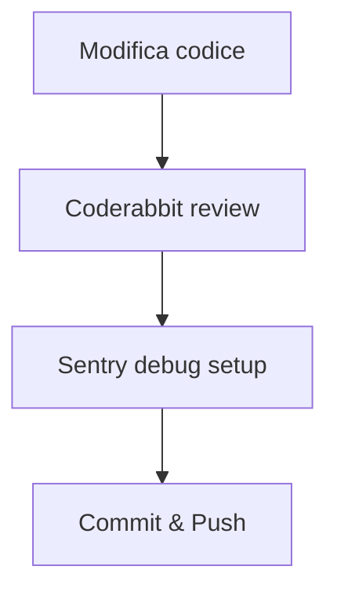
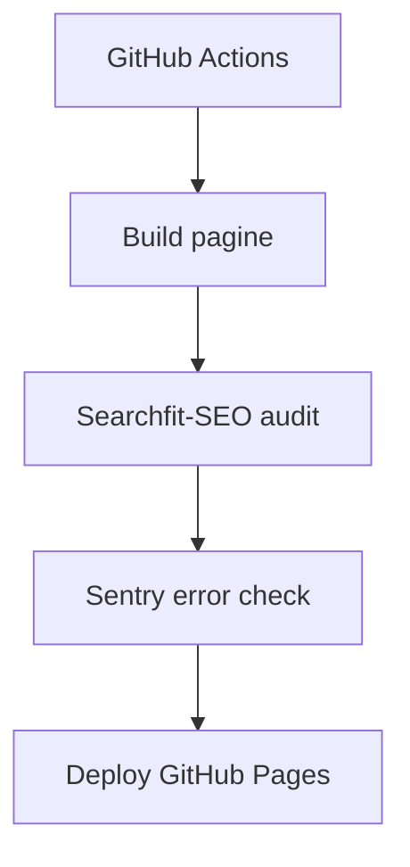
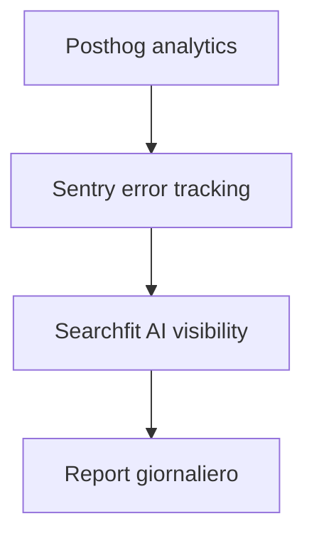

# 🎯 Guida Plugin per Progetto Giochi di Coop

## 📋 Plugin Consigliati per Ottimizzazione Lavoro

### **🎯 ESSENZIALI (Priorità Alta)**
1. **searchfit-seo** - Toolkit SEO completo
2. **posthog** - Analytics e monitoraggio
3. **sentry** - Error tracking e debug

### **📈 UTILI (Priorità Media)**
4. **coderabbit** - Code review avanzata
5. **mintlify** - Generazione documentazione

---

## 🔧 **1. SEARCHFIT-SEO - Toolkit SEO Avanzato**

### **Quando Usarlo:**
- ✅ **Dopo generazione pagine** → Audit SEO automatico
- ✅ **Prima deploy** → Verifica schema markup e thin content
- ✅ **Analisi competitor** → Benchmark vs altri siti gaming
- ✅ **Ottimizzazione keyword** → Clustering e strategia contenuti
- ✅ **Tracciamento AI visibility** → Monitora presenza in AI Overviews

### **Comandi Utili:**
```bash
# Audit completo del sito
"Audit SEO di giochidicoopia.it"

# Check specifico pagine game
/seo-check games/12345.html

# Genera schema markup per VideoGame
/generate-schema VideoGame --context "gioco cooperativo"

# Cluster keyword per categorie
/keyword-cluster "coop games, multiplayer, local co-op, online co-op, couch gaming"

# Analisi competitor
"Analizza SEO vs coopgamers.com e cooptimus.com"
```

### **Per il Nostro Progetto:**
- **Audit automatico** dopo ogni build (`scripts/build_static_pages.py`)
- **Validazione schema JSON-LD** per ogni pagina gioco
- **Ottimizzazione thin content** (130-170 parole)
- **Monitoraggio AI visibility** (ChatGPT, Perplexity, Google AI Overviews)

---

## 📊 **2. POSTHOG - Analytics e Monitoraggio**

### **Quando Usarlo:**
- ✅ **Monitoraggio traffico** → Analytics in tempo reale
- ✅ **Feature flags** → Test A/B nuove feature
- ✅ **Experiments** → Test conversioni e UX
- ✅ **Error tracking** → Integrazione con Sentry
- ✅ **LLM analytics** → Tracciamento costi AI

### **Comandi Utili:**
```bash
# Analytics traffico
/posthog:insights "traffico ultima settimana"

# Feature flags per test
/posthog:flags "crea flag 'nuovo_layout' per 10% utenti"

# Query natural language
/posthog:query "quante visite pagine gioco?"

# Dashboard monitoraggio
/posthog:dashboards "crea dashboard Performance"
```

### **Per il Nostro Progetto:**
- **Monitoraggio pagine** → Quali giochi più visitati
- **Test UX** → A/B test layout scheda gioco
- **Analytics conversioni** → Click su link affiliate
- **Performance Core Web Vitals** → Monitora LCP, FID, CLS

---

## 🐛 **3. SENTRY - Error Tracking e Debug**

### **Quando Usarlo:**
- ✅ **Errori produzione** → Monitoraggio 24/7
- ✅ **Debug JavaScript** → Errori client-side
- ✅ **Performance issues** → Slow pages e timeouts
- ✅ **Code review** → Integrazione con PR
- ✅ **Alerting** → Notifiche errori critici

### **Comandi Utili:**
```bash
# Errori recenti
/seer "errori ultime 24 ore"

# Setup per progetto statico
"Setup Sentry per sito statico HTML/JS"

# Alert configurazione
/sentry-create-alert "errori > 100/ora → Slack"

# Debug specifico
/seer "debug errori console games.js"
```

### **Per il Nostro Progetto:**
- **Monitoraggio errori JS** → `games.js` (94K token)
- **Performance pagine** → Load time pagine game (~574)
- **Alert deploy** → Notifica errori post-build
- **Integration CI/CD** → `.github/workflows/update.yml`

---

## 🔍 **4. CODERABBIT - Code Review Avanzata**

### **Quando Usarlo:**
- ✅ **Pre-commit** → Review automatica modifiche
- ✅ **Security check** → Vulnerabilità e secrets
- ✅ **Code quality** → Best practices e patterns
- ✅ **Complex logic** → Review algoritmi critici
- ✅ **PR review** → Integrazione GitHub

### **Comandi Utili:**
```bash
# Review file specifico
"Review scripts/build_static_pages.py"

# Security audit
"Check sicurezza script Python"

# Complex logic review
"Review algoritmo thin content generation"

# PR integration
"Review PR #123 con focus SEO changes"
```

### **Per il Nostro Progetto:**
- **Review script generazione** → `build_static_pages.py`, `seo_content_generator.py`
- **Security audit** → Controllo template injection
- **Quality gate** → Validazione pre-deploy
- **PR automation** → Integrazione con GitHub Actions

---

## 📚 **5. MINTLIFY - Documentazione**

### **Quando Usarlo:**
- ✅ **Documentazione progetto** → Generazione automatica
- ✅ **API documentation** → Documentazione endpoint (se presenti)
- ✅ **Component library** → Documentazione componenti
- ✅ **Knowledge base** → Documentazione processi
- ✅ **SEO documentation** → Documentazione strategia SEO

### **Comandi Utili:**
```bash
# Genera documentazione
/mintlify "documenta pipeline generazione"

# Component documentation
/mintlify "documenta template system"

# API docs (future)
/mintlify "documenta API cataloghi"

# SEO strategy docs
/mintlify "documenta strategia SEO"
```

### **Per il Nostro Progetto:**
- **Documentazione pipeline** → `scripts/INDEX.md` aggiornato
- **Template documentation** → `safe_template()` e best practices
- **SEO strategy docs** → Documentazione ottimizzazioni
- **Deployment guide** → Guida deploy GitHub Pages

---

## 🔄 **Workflow Integrato per il Progetto**

### **Fase 1: Sviluppo (Daily)**


### **Fase 2: Build (CI/CD)**


### **Fase 3: Monitoraggio (Post-deploy)**


---

## 🚀 **Setup Rapido (One-liner)**

```bash
# Installa tutti i plugin (da eseguire in Claude Code)
/plugin install searchfit-seo && /plugin install posthog && /plugin install sentry && /plugin install coderabbit && /plugin install mintlify
```

---

## 📈 **KPI e Metriche da Monitorare**

| Plugin | Metriche Chiave | Target |
|--------|----------------|---------|
| **searchfit-seo** | Schema validation, AI visibility score, Keyword ranking | 100% schema valid, Top 3 AI mentions |
| **posthog** | Pageviews, Conversion rate, Feature flag adoption | 10% ↑ conversion, 95% flag coverage |
| **sentry** | Error rate, MTTR, Performance score | <0.1% error rate, <5min MTTR |
| **coderabbit** | Issues caught, Security vulnerabilities, Code quality | >90% issues pre-production |
| **mintlify** | Documentation coverage, Update frequency | 100% core components documented |

---

## 🆘 **Troubleshooting Comune**

### **Plugin non si attiva:**
1. Verifica installazione: `ls ~/.claude/plugins/cache/`
2. Riavvia Claude Code
3. Re-installa: `/plugin reinstall <nome>`

### **Auth issues (Posthog/Sentry):**
1. Segui OAuth flow via `/mcp`
2. Verifica env vars: `POSTHOG_MCP_URL`, `SENTRY_DSN`
3. Check token scopes

### **Performance issues:**
1. Disabilita plugin non usati
2. Monitora memory usage
3. Usa `--pure` flag per debugging

---

## 📅 **Piano di Implementazione Fasi**

### **Fase 1 (Settimana 1):** Setup Base
- [ ] Install searchfit-seo + sentry
- [ ] Configura audit SEO automatico
- [ ] Setup error tracking baseline

### **Fase 2 (Settimana 2):** Analytics
- [ ] Install posthog + mintlify
- [ ] Configura analytics pagine
- [ ] Documentazione pipeline

### **Fase 3 (Settimana 3):** Ottimizzazione
- [ ] Install coderabbit
- [ ] Setup code review automatica
- [ ] Integrazione CI/CD completa

---

## 🔗 **Riferimenti e Risorse**

- **searchfit-seo**: https://github.com/searchfit/searchfit-seo
- **posthog**: https://github.com/PostHog/ai-plugin
- **sentry**: https://github.com/getsentry/sentry-for-claude
- **coderabbit**: https://github.com/coderabbitai/claude-plugin
- **mintlify**: https://github.com/mintlify/mintlify-claude-plugin

---

*Ultimo aggiornamento: 2026-04-08*  
*Autore: AI Assistant per Giochi di Coop*  
*Versione: 1.0*